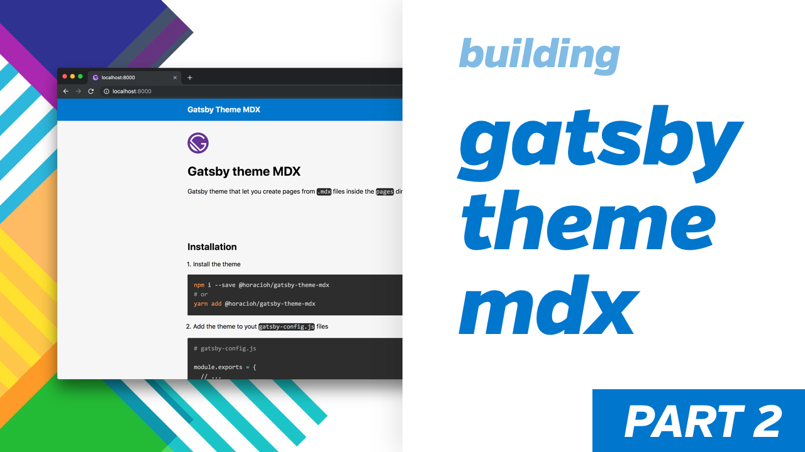

<p align="center">
  <a href="https://www.gatsbyjs.org">
    
  </a>
</p>

<h1 align="center">
  Gatsby theme MDX Demo page
</h1>

```bash
yarn workspace demo develop
```

## Checkout how I built this theme here

[](https://www.youtube.com/watch?v=nSBGdZ4BICw)

[](https://www.youtube.com/watch?v=jKrWGaPGRDo)
