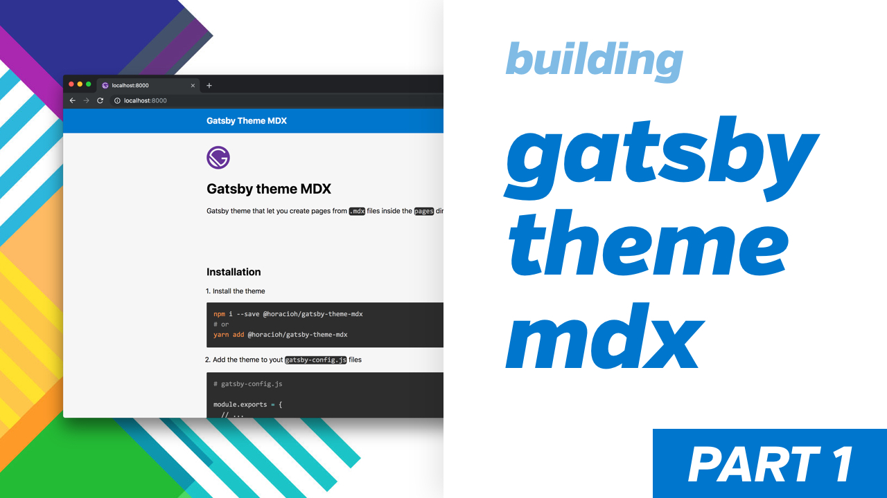

<p align="center">
  <a href="https://www.gatsbyjs.org">
    
  </a>
</p>

# Gatsby theme MDX


Gatsby theme that let you create pages from `.mdx` files inside the `pages` directory

[**DEMO**](https://gatsby-theme-mdx.netlify.com/)

## Checkout how I built this theme here

[](https://www.youtube.com/watch?v=nSBGdZ4BICw)

[](https://www.youtube.com/watch?v=jKrWGaPGRDo)

## Installation

- Install the theme

```bash
npm i --save @horacioh/gatsby-theme-mdx
# or
yarn add @horacioh/gatsby-theme-mdx
```

- Add the theme to yout `gatsby-config.js` files

```bash
# gatsby-config.js

module.exports = {
  // ...
  plugins: [
    // ...
    {
      resolve: `@horacioh/gatsby-theme-mdx`,
      options: {
        syntaxHighlight: true // (default: true) add/remove syntax highlight with `gatsby-remark-prismjs`
      }
    }
  ]
}
```

- Create `.mdx` files on your `src/pages` folder and you are all set.

```mdx
// pages/index.mdx

# Hello MDX page
```

## This theme includes

- `gatsby-plugin-mdx`: to transform `.mdx` files to pages. [docs](https://www.gatsbyjs.org/packages/gatsby-plugin-mdx/)
- `gatsby-remark-prismjs`: to style codeblocks properly. [docs](https://www.gatsbyjs.org/packages/gatsby-remark-prismjs/)
- `gatsby-plugin-theme-ui`: base & extensable styles for theme components. [docs](https://theme-ui.com/gatsby-plugin/)

## Issues & feedback

Any questions or feedback is welcome!. please if you don't understand something or need more documentation os some utility please file [an issue](https://github.com/horacioh/gatsby-theme-mdx/issues) or send me [a tweet](https://twitter.com/hhg2288).

Happy Theming!!
